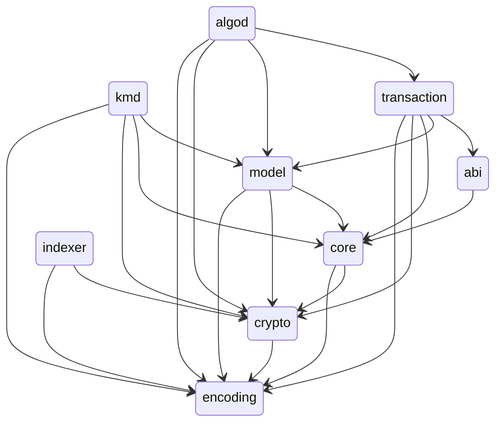

# Contributing to algonaut

**Note:** Any interaction with the project is subject to our [Code of Conduct](https://github.com/manuelmauro/algonaut/blob/main/CODE_OF_CONDUCT.md).

- [Contributing to algonaut](#contributing-to-algonaut)
  - [Submitting Issues](#submitting-issues)
  - [Pull Requests](#pull-requests)
    - [Submission Checklist](#submission-checklist)
  - [Running the test suite](#running-the-test-suite)
  - [Writing Documentation](#writing-documentation)
  - [Dependency Diagram](#dependency-diagram)
  - [Useful Resources](#useful-resources)

## Submitting Issues

One way you can help `algonaut` is to report bugs or request features on our GitHub issue tracker.

## Pull Requests

We are very happy to accept code contributions too! Please address issues in our tracker or if you have any idea how to improve the project open a pull request.

### Submission Checklist

Before submitting your pull request to the repository, please make sure you have done the following things first:

1. You have ensured the pull request is based on a recent version of your respective branch.
2. `make ci` completes without errors or warnings. It runs, in order:
   1. `make fmt-check` — `cargo fmt --all -- --check`
   2. `make clippy` — `cargo clippy --workspace --all-targets -- -D warnings`
   3. `make test` — `cargo test --workspace --lib --examples --tests`
   4. `make check-integration` — compile-checks the cucumber runner
   5. `make build` — `cargo build --workspace`

   The `lefthook` pre-commit hook runs `make ci` for you; install it with `make setup`.
3. If your change affects behaviour covered by the cucumber integration suite, you have run it against a local Algorand sandbox. See [Running the test suite](#running-the-test-suite) below; `make docker-test` runs the whole flow in Docker.

## Running the test suite

```bash
make setup           # rustfmt + clippy + lefthook hooks
make ci              # fmt-check, clippy, unit tests, build, integration compile-check
./test-harness.sh up # boot a local algorand sandbox (ports 60000/60001/60002)
make integration     # run the cucumber suite against the sandbox
```

See `docs/adr/` for the architectural decisions behind the cross-SDK cucumber wiring, the simulate / dryrun builders, the V3 source-map decoder, and the dual-format (`JSON`/msgpack) domain-type serialization.

## Writing Documentation

Documentation improvements are always welcome! A solid SDK needs to have solid documentation to go with it.

## Dependency Diagram



## Useful Resources

- [Git Style Guide](https://github.com/agis/git-style-guide)
- [How to write a Git commit message](https://chris.beams.io/posts/git-commit/)
